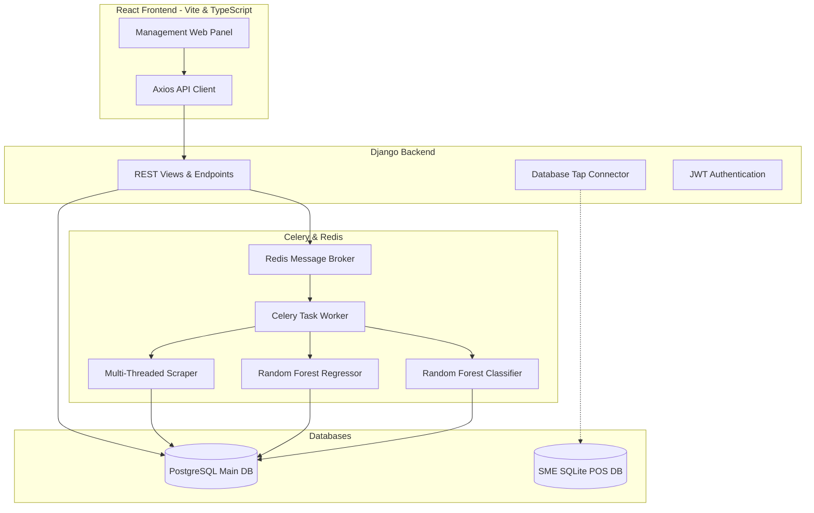

# SokoPulse: An Autonomous Competitor-Aware Dynamic Pricing Engine for Distributors and Retailers

## 1. Introduction

Distributors and retailers, particularly those handling fast-moving consumer goods and bulk commodities in Kenya, form the backbone of the local commerce network. In 2026, these businesses face severe competitive pressures, high operating costs, and rapid market fluctuations. Despite their economic importance, many small-to-medium distributors still rely on manual ledger systems or basic point-of-sale software. These traditional methods fail to provide real-time insights into market pricing, dynamic competitor rates, and future stock requirements.

Stock mismanagement often leads to a double-sided problem: stockouts of high-demand items, which result in lost revenue, and overstocking of low-demand products, which ties up valuable capital in perishable or depreciating goods. Additionally, distributors and retailers lack the tools to monitor competitor prices systematically. They must manually survey physical shelves or browse multiple online listings, a process that is time-consuming and prone to errors. Consequently, merchants set static prices that are either too high, driving customers to competitors, or too low, eroding profit margins.

SokoPulse addresses this operational gap by introducing an **Autonomous Competitor-Aware Dynamic Pricing Engine**. Operating as a middleware layer, the system overlays directly on top of a business's existing database via a database tap connector. It aggregates internal transaction histories and stock supply telemetry, scrapes real-time competitor prices, and processes these variables through a machine learning pipeline. SokoPulse dynamically optimizes commodity prices in KES, maximizing margins when the market permits, and triggering automated markdowns to clear overstocked or expiring assets before they spoil.

---

## 2. Problem Statement

Retail merchants and distributors in local Kenyan markets suffer from significant profit losses and high operational inefficiencies. These issues stem from a lack of real-time market data and predictive stock tools. 

Specifically, the operational inefficiencies are driven by three core problems:
1. **Stock Supply Imbalances:** Retailers and distributors face frequent stockouts of high-velocity goods or overstocking of slow-moving stock. This imbalance occurs because replenishment volumes rely on intuition rather than historical demand velocity and supplier reliability.
2. **Pricing Information Asymmetry:** Wholesalers and retailers lack real-time competitor pricing data. Monitoring market rates manually is labor-intensive and slow, preventing businesses from adjusting prices dynamically to capture margin opportunities or match competitor discounts.
3. **High Data Migration Barriers:** Existing ERP and stock management systems require complex, expensive, and disruptive data migration. Small-scale distributors cannot afford the cost or operational downtime required to replace their legacy databases.

According to data from the Kenya National Bureau of Statistics (KNBS), pricing inefficiencies and stock carrying costs contribute significantly to the failure rate of small-to-medium distributors in Kenya. Without an automated, integrated tool to forecast demand and monitor market price changes, independent distributors and retailers remain highly vulnerable to losses.

---

## 3. Objectives

The primary goal of this project is to develop SokoPulse, an autonomous competitor-aware dynamic pricing engine.

### Primary Objectives
1. **Design and Implement a Database Tap Connector:** Build a middleware engine that dynamically discovers schemas and syncs transaction and stock data from local SQLite databases to a centralized PostgreSQL database by October 2026.
2. **Develop a Multi-Threaded Competitor Price Scraper:** Create a scraping engine that crawls target online retail sites concurrently using rotating user agents, parsing price metadata from JSON-LD schemas in under 3 seconds per site by November 2026.
3. **Build a Demand Forecasting Model:** Train and deploy a Random Forest Regressor to recursively predict product sales demand for the next 30 days with a Mean Absolute Percentage Error (MAPE) below 15% by November 2026.
4. **Implement an Automated Action Classification Engine:** Build a Random Forest Classifier that cross-references stock levels, competitor pricing, and expiration dates to predict optimal business actions (raise margins, markdown overstock, trigger restocks, or diversify suppliers) by November 2026.

### Secondary Objectives
1. **Create a Monitoring Web Panel:** Design a responsive React dashboard to visualize competitor prices, stock-to-reorder ratios, and recommended pricing actions.
2. **Integrate SMS Alerts:** Connect to Africa's Talking SMS API to deliver automated stock warnings and price adjustment notifications.

---

## 4. Literature Review

This chapter reviews literature on dynamic pricing, machine learning-driven demand forecasting, and database synchronization.

### Thematic Analysis

#### 1. Dynamic Pricing and Competitor Scrawling
Dynamic pricing allows businesses to adjust prices in response to competitor activities and stock availability. Modern online retail relies on web scrapers to gather market pricing. However, websites deploy anti-bot protections, including rate limiting and IP blocking. Saurkar et al. (2018) show that resilient scrapers must employ concurrent connection pools and rotate User-Agent headers to avoid detection. Furthermore, extracting pricing from structured JSON-LD schemas rather than raw HTML renders scrapers resilient to website UI layout updates.

#### 2. Machine Learning in Demand Forecasting
Traditional forecasting models like ARIMA struggle with seasonal fluctuations and non-linear relationships in retail data. Ramos et al. (2021) demonstrate that ensemble methods, specifically Random Forest, outperform classical time-series models on tabular sales data. Random Forest accommodates multi-dimensional features (e.g., day of the week, promotional campaigns, and competitor price ratios) without requiring complex statistical assumptions.

#### 3. Database Tap and Synchronization Systems
Data pipelines for distributors must run without locking local database tables during business hours. Kleppmann (2017) outlines change data capture (CDC) and lightweight database connection technologies as crucial for syncing remote transactions without disrupting transactional operations. 

### Identified Gaps
Legacy ERP systems (SAP, Oracle) record internal transactions but are reactive, expensive, and do not track external competitor data. Conversely, basic POS systems use static rules (e.g., alert when stock is under 50 units) and fail to adjust for seasonal demand or competitor shifts. Large tech-enabled networks (like Twiga Foods or Copia) use proprietary dynamic pricing, but these systems are closed. SokoPulse addresses this gap as open, vendor-agnostic middleware, allowing independent distributors to access predictive pricing and supply intelligence using their existing databases.

---

## 5. Proposed System Architecture

SokoPulse is structured as decoupled dynamic pricing middleware, leveraging a client-server architecture.

### Component Details
1. **Frontend Dashboard:** A React client (Vite, TypeScript, TanStack Router) that visualizes stock supply metrics, competitor prices, and recommended pricing actions using Recharts.
2. **Django Backend:** Serves as the middleware layer. It hosts the REST API and the Database Tap Connector which polls the local SQLite POS database.
3. **Celery Worker & Redis Broker:** Executes long-running tasks asynchronously, such as web scraping and ML training.
4. **Scraping Engine:** A multi-threaded crawler using rotating User-Agents and JSON-LD schema parsing to fetch competitor prices.
5. **ML Forecaster:** A Random Forest Regressor that predicts product velocity (units sold) for the next 30 days.
6. **ML Decision Engine:** A Random Forest Classifier that predicts the optimal business action.

### Technology Rationale (Why Random Forest?)
1. **Tabular Data Efficiency:** Random Forest consistently outperforms deep neural networks on structured business tables (sales records, prices, safety buffers).
2. **Non-Linear Decision Splitting:** It handles complex feature interactions naturally (e.g., if a product has low expiration days *and* high competitor pricing, it recommends a markdown rather than a price raise).
3. **Explainability:** It allows managers to extract feature importance metrics, showing exactly why the engine recommended raising or lowering a price.
4. **Lightweight Compute Footprint:** Random Forest models train and run inference on standard CPUs in milliseconds, eliminating the need for expensive GPU cloud hosting.

---

## 6. Methodology

This project utilizes an Agile/Scrum development model to build and test components incrementally.

### Development Sprints
*   **Sprint 1 (Weeks 7-9):** Database Tap Connector and core Django models.
*   **Sprint 2 (Weeks 10-12):** Multi-threaded competitor scraper and Celery/Redis background task configurations.
*   **Sprint 3 (Weeks 13-15):** Random Forest Regressor (Forecasting) and Random Forest Classifier (Decision Engine) pipelines.
*   **Sprint 4 (Weeks 16-18):** React dashboard panel and API integrations.

### The Machine Learning Pipeline & Thresholds
The input features ($\vec{x}$) fed into SokoPulse's decision model include:
$$\vec{x} = [\text{Stock-to-Reorder Ratio}, \text{Competitor Price Ratio}, \text{Days until Expiration}]$$

The Random Forest Classifier outputs the probability of a dynamic action trigger:
*   **Action Threshold ($P \ge 0.75$):** The system automatically triggers the action (e.g., creates a dynamic discount voucher or updates the recommended KES price on the platform).
*   **Human-in-the-Loop Review Queue ($0.60 \le P < 0.75$):** The system routes the recommendation to the manager review panel for manual approval.
*   **No Action ($P < 0.60$):** Maintains current price and status.

### Testing Strategy
*   **Unit Tests:** PyTest for Python business logic and Jest for React components.
*   **Integration Tests:** API endpoint validation via Django's test client and task execution checks for Celery workers.
*   **User Acceptance Tests (UAT):** Piloting the system with a local distributor to test database sync speeds and pricing recommendation accuracy.

### Fallback Mechanisms
To ensure continuous operation during network outages or when dealing with newly introduced products with zero historical sales data, SokoPulse implements a **Heuristic Fallback Strategy**:
*   If the ML engine fails to initialize, the system falls back to calculating pricing recommendations based on a 7-day rolling sales average and pre-seeded default margins.
*   If the scraper is offline, the pricing engine runs using the last cached competitor price data.

### Success Criteria
1. The web scraper collects pricing data from 3 target websites in under 10 seconds.
2. The ML model forecasts sales with a MAPE below 15% on historical test datasets.
3. The Database Tap Connector completes transaction sync in under 5 seconds for a 10,000-row record dataset.
4. The system runs successfully within the resource limits of standard cloud hosting free tiers.

---

## 7. Timeline

The table below breaks the project down into 24 weekly tasks across two semesters.

| Week | Activity | Deliverable | Milestone |
| :--- | :--- | :--- | :--- |
| **1-3** | Literature review, domain research, and proposal writing | Finalized proposal document | **Proposal Submission** |
| **4-6** | Requirement analysis, database schema, and endpoint design | API contract and DB diagrams | |
| **7-9** | Django core backend & SQLite sync engine implementation | Database Sync API active | |
| **10-12** | Scraper development & Celery task configuration | Concurrent web scraper active | **MVP Release** |
| **13-15** | ML model training, evaluation, and markdown engine logic | Saved model files (`joblib`) | |
| **16-18** | Frontend development (dashboard, charts, integration) | Interactive dashboard | |
| **19-21** | Integration, testing, and debugging | Test suite execution report | **Feature Freeze** |
| **22-24** | Docker setup, hosting deployment, and final report writing | Deployed system & project report | **Final Submission** |

---

## 8. Budget

The budget outlines the cost metrics for SokoPulse, leveraging free tiers for storage and hosting during development.

| Item Category | Resource / Service | Unit Cost (KES / Month) | Quantity | Total Cost (KES - 6 Months) |
| :--- | :--- | :--- | :--- | :--- |
| **Hosting & Cloud** | Railway or Render Web Service | ~KES 1,000 (Free Tier/Basic) | 1 | KES 6,000 |
| **Database Storage** | Supabase PostgreSQL Database | KES 0 (Free Tier) | 1 | KES 0 |
| **API Costs** | Africa's Talking SMS API | KES 0.80 per SMS | 1,000 SMS | KES 800 |
| **Data Collection** | Transport for distributor interviews & surveys | KES 3,000 | Lump Sum | KES 3,000 |
| **Domain Name** | `.co.ke` domain registration | KES 1,000 (Annual) | 1 | KES 1,000 |
| **Total Cost** | | | | **KES 10,800** |

---

## 9. Ethical Considerations

### Data Privacy
SokoPulse encrypts API requests using HTTPS and secures access via JSON Web Tokens (JWT). Transactional histories and customer identifiers synced from the local SQLite POS are anonymized at the local Database Tap layer prior to cloud database sync.

### Open Source Compliance
The system integrates open-source components under permissive licenses:
*   Django and Django REST Framework (BSD License)
*   React (MIT License)
*   Scikit-Learn (New BSD License)
*   Celery (BSD License)

All project code repositories will credit these libraries and comply with their licensing terms.

### Accessibility and Fairness
To ensure accessibility in low-bandwidth regions, SokoPulse provides automated SMS notifications. Additionally, the web panel features high-contrast UI layouts to accommodate dynamic viewing on budget mobile screens.

---

## 10. References

*   Kleppmann, M. (2017). *Designing Data-Intensive Applications: The Big Ideas Behind Reliable, Scalable, and Maintainable Systems*. O'Reilly Media.
*   Kenya National Bureau of Statistics (KNBS). (2024). *Economic Survey 2024: Micro, Small and Medium Establishments Report*. Government Printer.
*   Ramos, P., Santos, N., & Rebelo, R. (2021). *Comparing Machine Learning Models for Retail Sales Forecasting*. Journal of Retailing and Consumer Services, 60, 102451.
*   Saurkar, A. V., Pathare, S. A., & Gode, S. A. (2018). *An Overview of Web Scraping Techniques and Tools*. International Journal on Future Revolution in Computer Science & Communication Engineering, 4(4), 363-367.
*   Wandeto, J., & Muchiri, M. (2026). *CIT 4299: Systems Project Proposal Writing Guide*. Dedan Kimathi University of Technology.
